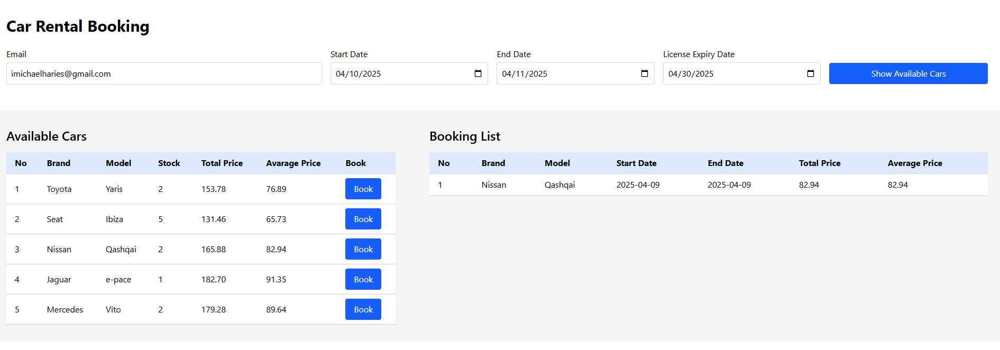
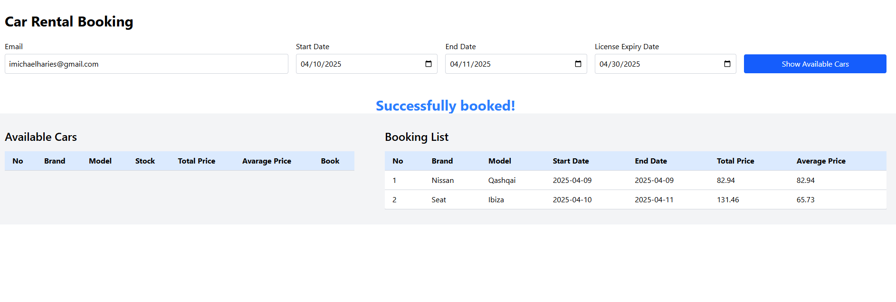

# Carental - Car Rental MVP

## Overview

This project is an MVP for the car rental platform in Barcelona developed for **Bolttech's Carental squad**. The goal of the MVP is to showcase a working bookings motor with a simple UI and functional backend. The primary focus is to demonstrate the car booking flow, allowing customers to view car availability, prices, and make bookings. The platform is built with React for the frontend and Express/TypeScript for the backend.

## User Stories

### US 1 - Availability View

As a customer, I want to see the availability of cars on concrete time slots so I can be informed of pricing and stock.

- **API Endpoint**: `/available-cars`
- **Response**:
  - A list of all available cars for the requested time slot.
  - Each car includes the complete booking price and average daily price.

### US 2 - Create a Booking

As a customer, I want to create a booking for a car.

- **API Endpoint**: `/bookings`
- **Booking Validation**:
  - Users can have only one booking for the same dates.
  - Driving license must be valid for the entire booking period.

## Features

- **Car Availability View**: Customers can view available cars for specific time slots.
- **Car Booking**: Customers can make bookings for cars, with validation for booking dates and driving license validity.
- **Seasonal Pricing**: Prices are based on three defined seasons: Peak, Mid, and Off-season.
- **Database Integration**: The app uses a database for storing car models, cars, users, and bookings. TypeORM is used to handle database operations in the backend.

## Tech Stack

- **Frontend**: React, Vite
- **Backend**: Express, TypeScript
- **Database**: MySQL, TypeORM
- **Testing**: Jest (for backend use case testing)

## Database Design

### Tables

1. **Models**:

   - `model_id`: Unique identifier for each model.
   - `model_name`: Name of the car model.
   - `price_peak`: Price during the peak season.
   - `price_mid`: Price during the mid season.
   - `price_off`: Price during the off season.

2. **Cars**:

   - `car_id`: Unique identifier for each car.
   - `model_id`: Foreign key referencing the `Car Models` table.
   - `brand`: Name of the car brand.

3. **Bookings**:

   - `booking_id`: Unique identifier for each booking.
   - `car_id`: Foreign key referencing the `Cars` table.
   - `user_id`: Foreign key referencing the `Users` table.
   - `start_date`: Start date of the booking.
   - `end_date`: End date of the booking.
   - `total_price`: Total price for the booking.
   - `average_price`: Average daily price during the booking period.

4. **Users**:

   - `id`: Unique user ID.
   - `name`: User name (Used default username).
   - `email`: User's email address.
   - `password`: User's password (Used default password).
   - `expire_date`: The expiration date of the user's driving license.

## Development Setup

### Prerequisites

1. **Node.js** (v22)
2. **MySQL** database

### Installation

1. Clone the repository:

   ```bash
   git clone https://github.com/your-username/carental.git
   cd carental
   ```

2. Install dependencies for both frontend and backend:

   ```bash
    # Backend
    cd server
    npm install

    # Frontend

    cd client
    npm install
   ```

3. Set up the MySQL database:

Create a MySQL database for the project.

Update the database connection settings in the `.env` file. 

4. Run the migrations and seeds to set up the database schema:

```bash
cd server
npm run migration:run
npm run seed:cars
```

5. Run the backend server:

```bash

npm run dev
```

6. Run the frontend server:

```bash

cd client
npm run dev
```
## Preview




## Future Improvements

- While this is an MVP, there are several improvements that can be added in the future:

- User Authentication: Integration with SSO, Google Auth, and third-party authentication SDKs.

- Booking Calendar: Improve the UI to include an interactive calendar for date selection.

- Admin Dashboard: Create an admin interface for managing cars, bookings, and users.

- Advanced Pricing: Implement dynamic pricing strategies based on demand, car condition, etc.
